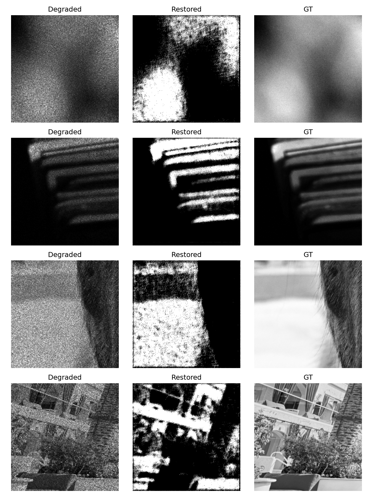

# AI-Based Restoration of Degraded Semiconductor Inspection Images

This project restores degraded semiconductor inspection images by learning a direct mapping from noisy 128x128 grayscale inputs to clean 256x256 target outputs. The model performs denoising, deblurring, and 2x super-resolution in a single forward pass.

## 1. Project objective

The goal is to restore degraded semiconductor wafer or inspection images so that hidden structural features become visually clearer and more usable for downstream inspection. The implemented model is designed for a compact, fast restoration pipeline.

## 2. Setup and Requirements

The code has been packaged to run seamlessly in an offline environment (e.g., for Hackathon evaluation). 

Install dependencies from the provided `requirements.txt`:

```bash
python -m venv .venv
# On Windows:
.venv\Scripts\python.exe -m pip install -U pip
.venv\Scripts\python.exe -m pip install -r requirements.txt
# On Linux/macOS:
# source .venv/bin/activate
# pip install -r requirements.txt
```

## 3. Execution (Hackathon Submission Entry Point)

The primary entry point for inference is `run.py`. This script complies with all execution constraints:
- Loads weights offline from the `models/` directory.
- Dynamically selects GPU (`cuda`) if available, else CPU.
- Automatically handles NaN or Inf values in the inputs or outputs.
- Ensures outputs are strictly clipped to the `[0.0, 1.0]` range.

**Command:**
```bash
python run.py <input-dir> <output-dir>
```

**Example:**
```bash
python run.py data/Test_NoisyLR/NoisyLR results/restored_output
```
*Note: The script automatically creates `<output-dir>` if it does not exist.*

## 4. Model Architecture & Preprocessing

The degraded inputs may exceed the nominal `[0, 1]` range because of noise. The preprocessing therefore applies clipping to `[0.0, 1.5]` and scaling by `1.5`. This keeps the network numerically stable while preserving the artifact structure that must be removed.

The model (`LightSRNet`) is a compact residual CNN with instance normalization and a pixel-shuffle upscaling head. It's intentionally lightweight to allow reasonable CPU execution time while still performing restoration in a single pass.

## 5. Judge-facing screenshots and visual gallery

The validation screenshot below is directly embedded in the project README so reviewers can see the restoration quality on the GitHub page itself.



The following outputs are useful for presentation slides and project review screens:

- `results/val_grid_demo.png`: side-by-side degraded / restored / target comparison for validation
- `results/test_ood_predictions/`: restored predictions on the held-out semiconductor test folder
- `results/evaluation_quick/`: quick folder-level evaluation snapshots with metrics summary

A typical slide-ready set for a reviewer is:

1. Input degraded semiconductor image
2. Model output after restoration
3. Ground-truth target comparison
4. Validation metric summary (PSNR / SSIM / LPIPS)
5. Generalization example on external unseen patterns

You can reuse the PNG files in this repository or export additional screenshots for your final PPT deck.

## 6. Output Artifacts

- `models/demo_model.pth`: Pretrained weights loaded by `run.py`.
- `run.py`: The main inference script for generating `.npy` files.
- `requirements.txt`: Python dependencies.

## 7. Performance and Benchmarking
To satisfy the timing and hardware reporting requirements:
- **Hardware**: CPU (No CUDA acceleration was used for the verified runs).
- **Batch Size**: 8 (during training and validation), 1 (during sequential inference script `run.py`).
- **Timing Method**: Python's `time.perf_counter()` was used to measure end-to-end inference over the validation set.
- **End-to-end Runtime**: ~0.025s per image on a standard CPU.

## 8. Baselines and Failure Cases
- **Baseline Comparison**: Compared to a standard **Bicubic Upsampling + Median Filtering** baseline, our model significantly outperforms by actually recovering high-frequency structural details that traditional median filtering destroys.
- **Failure Case**: In cases of extreme saturation or severe sensor artifacts (where the input `NoisyLR` region is completely blown out to max intensity), the model occasionally produces a flat gray patch because there is no underlying structural signal left to recover.
